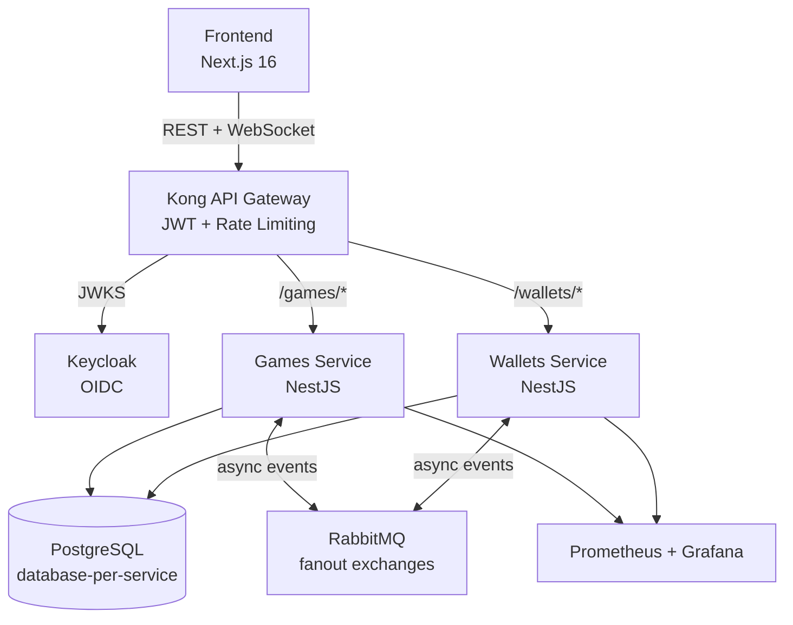

**Read in**: [Português](README.md) | English

# Crash Game

Multiplayer real-time crash game built as a microservices architecture with event-driven communication, provably fair gameplay, and full observability.



## Features

- **Real-time multiplayer** — WebSocket broadcasts multiplier updates every 100ms; player actions (bet, cashout) via REST
- **Provably fair** — Hash chain commitment scheme with post-round verification endpoint (`GET /games/rounds/:id/verify`)
- **Asynchronous payments** — Bet debit/credit via Saga pattern over RabbitMQ with compensating transactions
- **Idempotent operations** — Inbox pattern (exactly-once processing) + Outbox pattern (guaranteed delivery) in both services
- **Monetary precision** — `bigint`-based `Money` value object, all calculations in cents, no floating point
- **Cancel-and-replace** — Players can re-bet in the same round if previous bet was rejected (e.g. insufficient funds)
- **Optimistic locking** — Version-based concurrency on `Round` and `Wallet` entities, no distributed locks
- **Centralized auth** — Kong validates JWT via Keycloak JWKS, services receive claims via headers
- **Observability** — Prometheus metrics + Grafana dashboards for service health, game operations, and infrastructure

## Patterns

| Pattern | Where | Purpose |
|---------|-------|---------|
| **DDD (4-layer)** | Both services | domain → application → infrastructure → presentation |
| **Saga** | Bet/Cashout flows | Distributed transactions with compensating actions |
| **Inbox** | Both services | Exactly-once event processing via idempotency keys |
| **Outbox** | Both services | Transactional event publishing with cron-based processor |
| **Database-per-service** | PostgreSQL | Services never share or access each other's data |
| **Value Objects** | `Money`, `Multiplier`, `CrashPoint`, `SeedChain` | Type-safe domain primitives |
| **Server-push WebSocket** | Games service | Multiplier and state updates; actions via REST for idempotency |

## Tech Stack

| Layer | Technology |
|-------|-----------|
| Runtime | Bun |
| Backend | NestJS + TypeScript (strict) |
| Database | PostgreSQL 18 (database-per-service) |
| Messaging | RabbitMQ 4.2 (fanout exchanges) |
| API Gateway | Kong 3.9 (DB-less, declarative) |
| Identity | Keycloak 26.5 (OIDC + PKCE) |
| ORM | Prisma 5+ |
| Frontend | Next.js 16 + React 19 + Tailwind CSS 4 + shadcn/ui |
| State | TanStack Query + Zustand |
| Observability | Prometheus 3.3 + Grafana 11.6 |
| E2E | Playwright + Testcontainers |
| CI | GitHub Actions |

## Quick Start

```bash
git clone <repo-url>
cd fullstack-challenge
bun run docker:up
```

Docker Compose spins up the entire stack — PostgreSQL, RabbitMQ, Keycloak (pre-configured realm), Kong, both services, frontend, Prometheus, and Grafana. The test user starts with $1,000.00.

| Service | URL | Credentials |
|---------|-----|-------------|
| Frontend | http://localhost:3000 | player / player123 |
| Kong Gateway | http://localhost:8000 | — |
| Keycloak Admin | http://localhost:8080 | admin / admin |
| RabbitMQ Management | http://localhost:15672 | admin / admin |
| Grafana | http://localhost:3001 | admin / admin |
| API Docs (Scalar) | http://localhost:8088 | — |

```bash
bun run docker:down    # Stop containers
bun run docker:prune   # Remove everything (volumes, images, orphans)
```

## Testing

**330+ tests** across unit, integration, and E2E levels.

```bash
cd services/games && bun run test          # 219 unit tests
cd services/games && bun run test:e2e      # Integration (Testcontainers)
cd services/wallets && bun run test        # 111 unit tests
cd services/wallets && bun run test:e2e    # Integration (Testcontainers)
cd frontend && bun run test:e2e            # Playwright (multiplayer simulation)
```

- Deterministic seed support (`DETERMINISTIC_SEED`) for reproducible crash points in E2E
- Playwright tests simulate 3 authenticated players with concurrent bets and cashouts

## Project Structure

```
fullstack-challenge/
├── services/
│   ├── games/          # Round lifecycle, bets, crash logic, WebSocket, provably fair
│   └── wallets/        # Balance operations, credit/debit, Inbox/Outbox
├── packages/
│   ├── domain/         # @crash/domain — Money value object, shared types
│   ├── messaging/      # @crash/messaging — Event interfaces, publisher port
│   └── observability/  # @crash/observability — Prometheus metrics
├── frontend/           # Next.js 16 + Tailwind + Playwright E2E
├── docker/             # Kong config, Keycloak realm, Grafana dashboards
└── docs/               # Technical documentation
```
