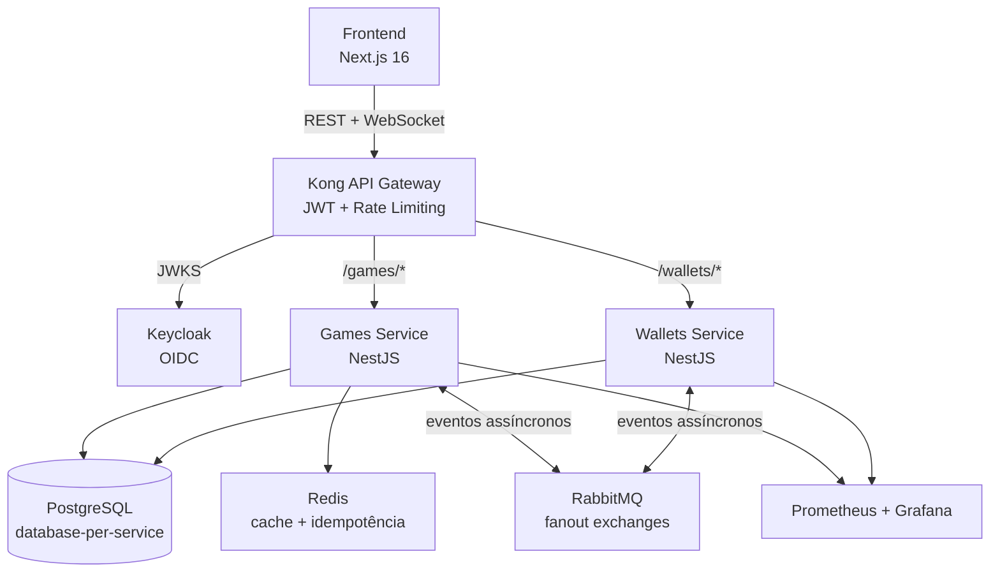
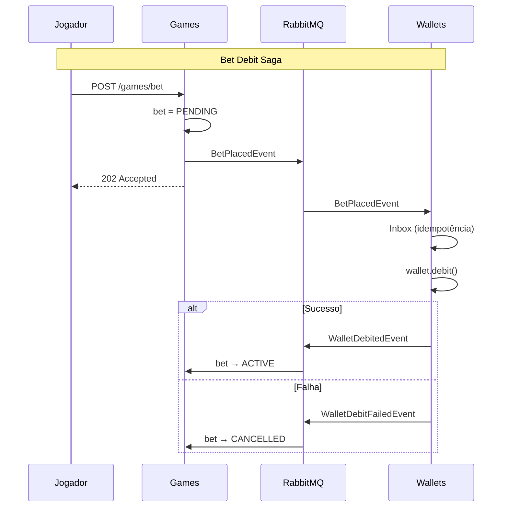
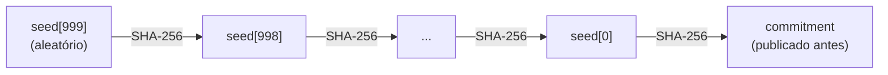

# Crash Game — Fullstack Challenge

Implementação completa de um Crash Game multiplayer em tempo real: dois microserviços de backend (Games e Wallets), frontend Next.js, API Gateway Kong e Identity Provider Keycloak.

---

## Instalação e Execução

### Pré-requisitos

- **Docker** e **Docker Compose** (Docker Desktop ou Docker Engine + Compose V2)

### Quickstart

```bash
git clone <repo-url>
cd fullstack-challenge
bun run docker:up
```

Pronto. O comando sobe toda a stack: PostgreSQL, Redis, RabbitMQ, Keycloak (com realm pré-configurado), Kong, Games Service, Wallets Service, Frontend, Prometheus, Grafana e Redis Exporter. As dependências são instaladas dentro dos containers — não é necessário `bun install` local.

O seeding da carteira é automático: o usuário de teste já inicia com $1.000,00 de saldo.

> **Nota sobre .env:** Os arquivos `.env` dos serviços e do frontend estão versionados para facilitar o setup — basta clonar e rodar `docker:up`. Isso **não é uma boa prática** para projetos reais, mas para este desafio elimina o atrito de configuração manual. Em produção, use secrets management (Vault, env vars do orquestrador, etc).

### URLs

| Serviço | URL | Credenciais |
|---------|-----|-------------|
| Frontend (jogo) | http://localhost:3000 | player / player123 |
| Kong (API Gateway) | http://localhost:8000 | — |
| Keycloak Admin | http://localhost:8080 | admin / admin |
| RabbitMQ Management | http://localhost:15672 | admin / admin |
| Grafana | http://localhost:3001 | admin / admin |
| Prometheus | http://localhost:9090 | — |
| API Docs (Scalar) | http://localhost:8088 | — |

### Comandos auxiliares

```bash
bun run docker:down    # Para os containers
bun run docker:prune   # Remove containers, volumes e imagens
```

---

## Arquitetura



### Stack

| Camada | Tecnologia |
|--------|-----------|
| Runtime | Bun |
| Backend | NestJS + TypeScript strict |
| Banco de dados | PostgreSQL 18 (database-per-service) |
| Cache | Redis 7.4 |
| Mensageria | RabbitMQ 4.2 |
| API Gateway | Kong 3.9 (DB-less, declarativo) |
| Identity | Keycloak 26.5 (realm: `crash-game`) |
| ORM | Prisma 5+ |
| Frontend | Next.js 16 + React 19 + Tailwind CSS 4 + shadcn/ui |
| Estado | TanStack Query + Zustand |
| Observabilidade | Prometheus 3.3 + Grafana 11.6 |
| Testes E2E browser | Playwright |
| CI/CD | GitHub Actions |

### Princípios

- **DDD com 4 camadas**: domain (zero deps) → application (use cases + ports) → infrastructure (Prisma, RabbitMQ, Redis, WebSocket) → presentation (controllers, DTOs)
- **Database-per-service**: Games e Wallets nunca acessam o banco um do outro
- **Comunicação assíncrona**: Toda comunicação financeira via RabbitMQ (fanout exchanges). Serviços nunca se chamam por REST
- **Monorepo**: Packages compartilhados (`@crash/domain`, `@crash/messaging`, `@crash/observability`)

---

## Decisões Arquiteturais

### Precisão monetária com `bigint`

O Value Object `Money` opera exclusivamente com `bigint` em centavos ($10.50 = 1050 cents). Conversão para decimal apenas na presentation. Payouts truncados com `floor` — favorável à casa, previne inconsistências.

### Saga Pattern (sem 2PC)



Cada Saga usa transações compensatórias. A bet começa `PENDING` (débito assíncrono) e transiciona para `ACTIVE` ou `CANCELLED` conforme resposta da wallet.

### Inbox + Outbox patterns

- **Inbox** (Wallets): Garante exactly-once processing via unique constraint em `idempotencyKey`. RabbitMQ redelivers são ignoradas.
- **Outbox** (Wallets): Eventos de resposta salvos na mesma transação do DB. Processor (cron 5s) publica os pendentes. Se RabbitMQ cai, eventos aguardam recovery.

### Cancel-and-Replace

Se a aposta está `PENDING` ou `CANCELLED`, o jogador pode apostar novamente no mesmo round — a bet anterior é substituída. Resolve o cenário: wallet rejeita (saldo insuficiente) → jogador deposita → tenta de novo sem esperar próximo round.

### Idempotência de cashout com Redis

Frontend gera UUID v4 por tentativa. `CashOutUseCase` verifica com `SET NX` (atômico). Duplo clique ou retry de rede não reprocessa.

### Tripla camada de estado

O round atual vive em: (1) in-memory (acesso instantâneo ao multiplicador), (2) Redis (leitura sub-ms para cashout), (3) PostgreSQL (fonte de verdade). O multiplicador muda a cada 100ms — DB não suporta esse throughput de escrita.

### Provably Fair (Hash Chain)



- **Antes**: Servidor publica `seedHash` (comprometimento)
- **Após crash**: Servidor revela `seed` (prova)
- **Verificação**: `GET /games/rounds/:id/verify` — jogador recalcula `SHA-256(seed) === seedHash`

Fórmula: `max(1.00, 0.96 / (primeiros_52_bits / 2^52))` com house edge de 4%. Seed chain criptografada (AES-256-GCM) em arquivo separado do banco.

### WebSocket server-push only

WebSocket exclusivamente para servidor → cliente. Ações do jogador (apostar, sacar) via REST (passam pelo Kong com JWT, facilitam idempotência).

### Optimistic Locking

Entidades `Round` e `Wallet` com campo `version`. PostgreSQL rejeita writes stale via Prisma. Concorrência sem distributed locks.

### Kong com autenticação centralizada

`bearer_jwt_verify` com JWKS discovery. Serviços não validam JWT — recebem claims via headers injetados pelo Kong. Rate limiting: 30 req/s (Games), 15 req/s (Wallets).

---

## API Reference

Todos os endpoints via Kong (`http://localhost:8000`). Swagger em `http://localhost:8088`.

### Games — `/games`

| Método | Endpoint | Auth | Descrição |
|--------|----------|------|-----------|
| `POST` | `/games/bet` | JWT | Aposta (202 Accepted, confirmação assíncrona) |
| `POST` | `/games/bet/cashout` | JWT | Sacar no multiplicador atual (idempotente) |
| `GET` | `/games/rounds/current` | — | Estado do round atual |
| `GET` | `/games/rounds/history` | — | Histórico paginado |
| `GET` | `/games/rounds/:id/verify` | — | Verificação provably fair |
| `GET` | `/games/bets/me` | JWT | Histórico de apostas do jogador |
| `GET` | `/games/bets/:betId` | — | Status de aposta (polling) |
| `GET` | `/games/health` | — | Health check |

### Wallets — `/wallets`

| Método | Endpoint | Auth | Descrição |
|--------|----------|------|-----------|
| `POST` | `/wallets` | JWT | Criar carteira |
| `GET` | `/wallets/me` | JWT | Saldo da carteira |
| `GET` | `/wallets/health` | — | Health check |

Crédito e débito não são expostos via REST — ocorrem exclusivamente via RabbitMQ.

---

## Testes

### Unitários (26 arquivos)

**Games** (19): Round lifecycle, Bet logic, Value Objects (Multiplier, CrashPoint, SeedChain, Money), Use Cases (PlaceBet, CashOut, ConfirmBet, CancelBet, VerifyRound), AES cipher.

**Wallets** (7): Wallet entity (debit/credit/saldo insuficiente), Money VO, Use Cases (Debit, Credit, Create, Get), PlayerWalletResolver.

### E2E

**Games + Wallets** (via Vitest): Fluxo completo apostar → multiplicador → cashout/crash → saldo atualizado. Integração entre serviços via RabbitMQ.

**Frontend** (via Playwright): Simulação multiplayer com 3 jogadores autenticados, apostas simultâneas, cashout e verificação de round history.

### Seed determinística

Variável `DETERMINISTIC_SEED` gera crash points previsíveis em testes E2E (ex: `test-crash-2-94` → crash em ~1.98x).

### Comandos

```bash
cd services/games && bun run test          # Unitários
cd services/games && bun run test:e2e      # E2E (requer docker:up)
cd services/wallets && bun run test        # Unitários
cd services/wallets && bun run test:e2e    # E2E (requer docker:up)
cd frontend && bun run test:e2e            # Playwright (requer stack rodando)
```

---

## CI/CD

GitHub Actions roda automaticamente em push para `main` (`.github/workflows/ci.yml`):

| Job | Descrição |
|-----|-----------|
| **Unit Tests - Games** | `bun test tests/unit` no serviço Games (219 testes) |
| **Unit Tests - Wallets** | `bun test tests/unit` no serviço Wallets (116 testes) |
| **Lint** | Prettier formatting check em ambos serviços |
| **E2E Tests** | Testes de integração (depende dos 3 acima passarem) |

---

## Pontos Bônus Implementados

| Bônus | Descrição |
|-------|-----------|
| **Inbox/Outbox transacional** | Exactly-once processing (Inbox) + entrega garantida (Outbox) no Wallets Service |
| **Observabilidade** | Prometheus + Grafana com 3 dashboards (Service Health, Game Operations, Infrastructure). Package `@crash/observability` compartilhado |
| **Seed determinística** | Env var `DETERMINISTIC_SEED` para crash points reproduzíveis em E2E |
| **Efeitos sonoros** | Hook `useGameSounds` — áudio para aposta, cashout e crash |
| **Rate limiting** | Kong plugin: 30 req/s (Games), 15 req/s (Wallets) |
| **Swagger/OpenAPI** | `@nestjs/swagger` em ambos serviços, Scalar UI em `http://localhost:8088` |
| **Playwright E2E** | Testes browser multiplayer simulando login, apostas e cashout com 3 jogadores |

---

## Melhorias Futuras

### Sistema de Ledger

A carteira atual registra apenas o saldo. Um sistema de ledger (razão) com entradas e saídas detalhadas proporcionaria auditabilidade completa, reconciliação de saldo e atendimento a requisitos regulatórios de iGaming.

### Workers com BullMQ

O processamento de Inbox/Outbox usa cron jobs. BullMQ permitiria processamento concorrente e paralelo, backpressure automático, retry com backoff exponencial, priorização (cashouts antes de confirmações) e dashboard de filas.

### Auto Cashout

O jogador define um multiplicador alvo para saque automático. A UI já existe (`AutoCashoutInput` no frontend) — falta conectar ao backend verificando o target a cada tick (100ms) no `RoundLifecycleManager`.

### Leaderboard

Ranking de top jogadores por lucro (24h/semana) consumindo eventos de cashout.

---

## Estrutura

```
fullstack-challenge/
├── services/
│   ├── games/          # Round lifecycle, bets, crash, WebSocket, provably fair
│   └── wallets/        # Balance, debit/credit, Inbox/Outbox
├── packages/
│   ├── domain/         # @crash/domain — Money VO
│   ├── messaging/      # @crash/messaging — Event interfaces
│   └── observability/  # @crash/observability — Prometheus metrics
├── frontend/           # Next.js 16 + Tailwind + Playwright E2E
├── docker/             # Kong, Keycloak realm, Prometheus, Grafana dashboards
└── docs/               # Documentação técnica detalhada
```

Documentação técnica em `docs/`:

| Arquivo | Conteúdo |
|---------|----------|
| `architecture-overview.md` | Stack, topologia, DDD, shared packages |
| `payment-saga.md` | Fluxos de pagamento, Inbox/Outbox patterns |
| `round-engine-redis.md` | Lifecycle dos rounds, máquina de estados, Redis |
| `provably-fair-algorithm.md` | Hash chain, crash point, verificação |
