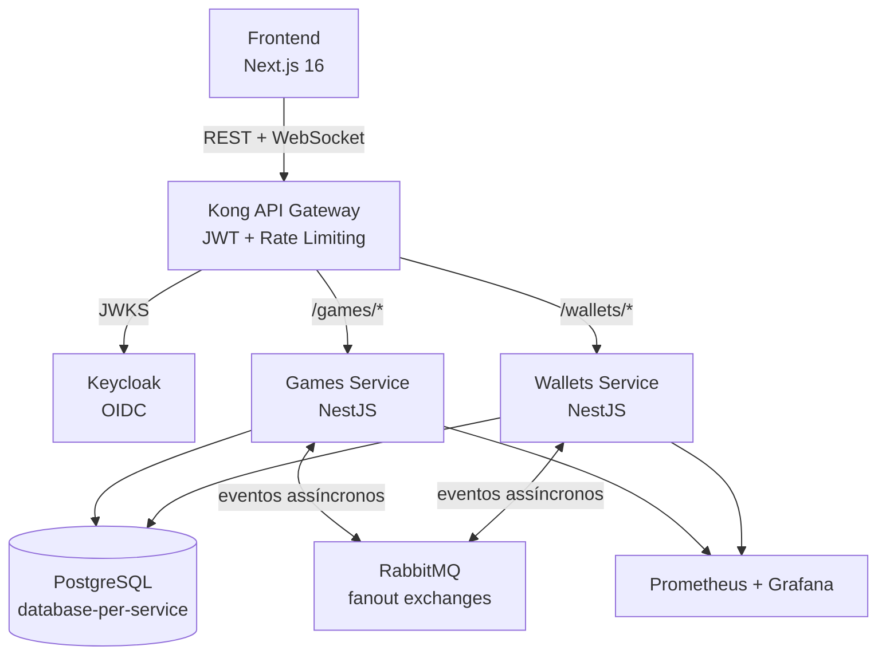

**Leia em**: Português | [English](README.en.md)

# Crash Game

Jogo crash multiplayer em tempo real com arquitetura de microsserviços, comunicação orientada a eventos, mecanismo provably fair e observabilidade completa.



## Features

- **Multiplayer em tempo real** — WebSocket transmite atualizações do multiplicador a cada 100ms; ações do jogador (aposta, cashout) via REST
- **Provably fair** — Esquema de compromisso com hash chain e endpoint de verificação pós-round (`GET /games/rounds/:id/verify`)
- **Pagamentos assíncronos** — Débito/crédito de apostas via Saga pattern sobre RabbitMQ com transações compensatórias
- **Operações idempotentes** — Inbox pattern (exactly-once processing) + Outbox pattern (entrega garantida) em ambos os serviços
- **Precisão monetária** — Value Object `Money` baseado em `bigint`, cálculos em centavos, sem ponto flutuante
- **Cancel-and-replace** — Jogadores podem reapostar no mesmo round se a aposta anterior foi rejeitada (ex: saldo insuficiente)
- **Optimistic locking** — Concorrência baseada em versão nas entidades `Round` e `Wallet`, sem locks distribuídos
- **Auth centralizada** — Kong valida JWT via Keycloak JWKS, serviços recebem claims via headers
- **Observabilidade** — Métricas Prometheus + dashboards Grafana para saúde dos serviços, operações de jogo e infraestrutura

## Padrões

| Padrão | Onde | Propósito |
|--------|------|-----------|
| **DDD (4 camadas)** | Ambos serviços | domain → application → infrastructure → presentation |
| **Saga** | Fluxos Bet/Cashout | Transações distribuídas com ações compensatórias |
| **Inbox** | Ambos serviços | Processamento exactly-once via chaves de idempotência |
| **Outbox** | Ambos serviços | Publicação transacional de eventos com processador cron |
| **Database-per-service** | PostgreSQL | Serviços nunca compartilham ou acessam dados um do outro |
| **Value Objects** | `Money`, `Multiplier`, `CrashPoint`, `SeedChain` | Primitivos de domínio type-safe |
| **Server-push WebSocket** | Games service | Atualizações de multiplicador e estado; ações via REST para idempotência |

## Tech Stack

| Camada | Tecnologia |
|--------|-----------|
| Runtime | Bun |
| Backend | NestJS + TypeScript (strict) |
| Banco de dados | PostgreSQL 18 (database-per-service) |
| Mensageria | RabbitMQ 4.2 (fanout exchanges) |
| API Gateway | Kong 3.9 (DB-less, declarativo) |
| Identidade | Keycloak 26.5 (OIDC + PKCE) |
| ORM | Prisma 5+ |
| Frontend | Next.js 16 + React 19 + Tailwind CSS 4 + shadcn/ui |
| Estado | TanStack Query + Zustand |
| Observabilidade | Prometheus 3.3 + Grafana 11.6 |
| E2E | Playwright + Testcontainers |
| CI | GitHub Actions |

## Quick Start

```bash
git clone <repo-url>
cd fullstack-challenge
bun run docker:up
```

O Docker Compose sobe toda a stack — PostgreSQL, RabbitMQ, Keycloak (realm pré-configurado), Kong, ambos os serviços, frontend, Prometheus e Grafana. O usuário de teste inicia com $1.000,00.

| Serviço | URL | Credenciais |
|---------|-----|-------------|
| Frontend | http://localhost:3000 | player / player123 |
| Kong Gateway | http://localhost:8000 | — |
| Keycloak Admin | http://localhost:8080 | admin / admin |
| RabbitMQ Management | http://localhost:15672 | admin / admin |
| Grafana | http://localhost:3001 | admin / admin |
| API Docs (Scalar) | http://localhost:8088 | — |

```bash
bun run docker:down    # Para os containers
bun run docker:prune   # Remove containers, volumes e imagens
```

## Testes

**330+ testes** entre unitários, integração e E2E.

```bash
cd services/games && bun run test          # 219 testes unitários
cd services/games && bun run test:e2e      # Integração (Testcontainers)
cd services/wallets && bun run test        # 111 testes unitários
cd services/wallets && bun run test:e2e    # Integração (Testcontainers)
cd frontend && bun run test:e2e            # Playwright (simulação multiplayer)
```

- Suporte a seed determinística (`DETERMINISTIC_SEED`) para crash points reproduzíveis em E2E
- Testes Playwright simulam 3 jogadores autenticados com apostas e cashouts concorrentes

## Estrutura do Projeto

```
fullstack-challenge/
├── services/
│   ├── games/          # Ciclo de vida do round, apostas, lógica de crash, WebSocket, provably fair
│   └── wallets/        # Operações de saldo, crédito/débito, Inbox/Outbox
├── packages/
│   ├── domain/         # @crash/domain — Value Object Money, tipos compartilhados
│   ├── messaging/      # @crash/messaging — Interfaces de eventos, publisher port
│   └── observability/  # @crash/observability — Métricas Prometheus
├── frontend/           # Next.js 16 + Tailwind + Playwright E2E
├── docker/             # Config Kong, realm Keycloak, dashboards Grafana
└── docs/               # Documentação técnica
```
